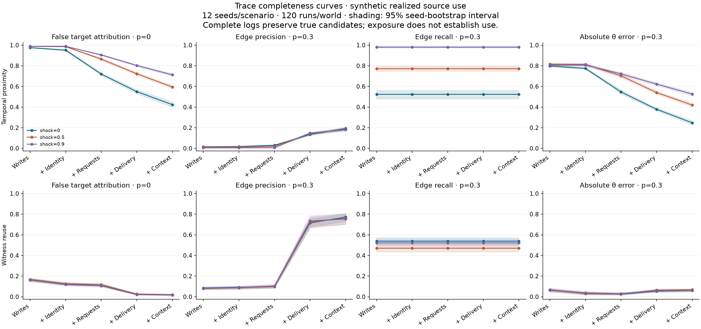

# Trace Completeness Curves

**The utility pilot did not establish a general reasoning benefit from provenance
assistance: every schema-valid status was correct, and Sonnet's observed score
differences concerned response acceptance.** This finding concerns the utility
pilot; the separate responsiveness study contains a verified incorrect Terra answer.

Read the [current research synthesis](docs/FINAL_SUBMISSION.md) for the connected
findings and the [verification reference](docs/REVIEWER_GUIDE.md) for sources and
access limits. The [original submission](docs/SUBMISSION.md) remains historical.

Trace Completeness Curves tests what incomplete agent logs can establish about
information flow. Its five completed attribution and investigator studies are:

- **[Synthetic source-attribution benchmark](results/REPORT.md):** Measure attribution
  errors against known realized source-use edges as different telemetry types become
  available.
- **[Missing-receipt stress test](studies/missing_receipts/results/REPORT.md):** Erase
  observable records from fixed worlds. Preserving exposure evidence can recover true
  source candidates, but can also increase false attribution; the tradeoff depends on
  the investigator's candidate selection.
- **[Public-wiki case study](studies/wiki_case_study/REPORT.md):** Audit 13,403 DSE
  revisions. Under the frozen comparison rule, 7,380 of 10,520 eligible snapshot
  reference pairs (70.15%) contain only inherited references. This describes recorded
  text; exposure remains unknown and source use unobserved.
- **[Investigator-utility pilot](studies/investigator_utility/openrouter_v1/results/REPORT.md):**
  Compare raw evidence, a strong checklist, and added deterministic provenance assistance
  on 16 wiki cases and eight synthetic fixtures with two model families. The completed
  pilot does not establish a general reasoning advantage: Terra was at ceiling and
  Sonnet's differences concerned response-contract reliability. Its wiki assistance
  condition matched the raw-evidence baseline.

- **[Evidence-responsiveness audit](studies/evidence_responsiveness/results/REPORT.md):**
  Test 12 certified evidence-change families with two models. Terra passes every
  decisive pair but fails one wiki invariant pair; Sonnet’s paired scores are dominated
  by invalid responses. Controlled wiki edits are fixtures, not incident observations.

The separate [finite evidence-acquisition extension](studies/evidence_acquisition/RESULTS.md)
compares passive retrieval policies under an explicit archive model. Its technical
report retains cost gains, adverse comparisons, and the limits of checkable ambiguity.

Exposure is not source use, and source use is not counterfactual causal necessity.
See the [initial benchmark's claims and analysis specification](CLAIMS.md) and each
study's report for its scope and limitations.

## Completed investigator-utility pilot

**This pilot does not establish a general forensic-reasoning benefit from provenance
assistance.** It reports a bounded comparison with flat, adverse and invalid outcomes retained.

All schema-valid utility statuses were correct. Sonnet's 18 rejected evaluation
responses comprise eight field-ID problems, six serialization problems and four
refusals; Terra has no rejected evaluation responses. A separate
[retrospective diagnostic](studies/review_remediation/utility_diagnostic.json)
recovers 12 Sonnet responses under fixed, gold-blind extraction/field rules. Two
multi-object responses remain ambiguous and all four refusals remain failures.
These diagnostic results do not replace the primary scores below. Native
JSON-schema enforcement was not requested in any of the 144 saved evaluation
request bodies; performance under such enforcement was not measured.

**Primary comparison: C−B**, where A receives raw evidence and a competent task, B adds
a strong checklist, and C adds record indexing, full character alignments, locators,
and equality groups to B. Every arm retains the same raw facts; C supplies no hidden
labels or exposure/use verdicts. This is an exploratory follow-up.

**Unjustified certainty (UC) is zero in every arm, model, and subset**, but invalid
responses do not count as successful restraint. UC counts schema-valid definite
answers to unresolved claims. Its companion diagnostic,
**certainty-or-invalid**, includes schema and citation failures on unresolved claims.
Warranted-answer accuracy (WAA) measures correct, schema-valid definite answers to
answerable claims. Both primary outcomes must be read with the failure diagnostic.

All table values are percentages; differences and intervals are percentage points.

| Requested model alias | Subset | WAA A / B / C | Primary WAA C−B [95% interval] | Certainty-or-invalid B → C |
| --- | --- | ---: | ---: | ---: |
| `anthropic/claude-sonnet-5.5` | Wiki | 93.75 / 75.00 / 93.75 | +18.75 [0.00, 37.50] | 25.00 → 9.38 |
| `anthropic/claude-sonnet-5.5` | Synthetic | 42.86 / 42.86 / 71.43 | +28.57 [−28.57, 71.43] | 40.00 → 40.00 |
| `openai/gpt-5.6-terra` | Wiki | 100 / 100 / 100 | 0 [0, 0] | 0 → 0 |
| `openai/gpt-5.6-terra` | Synthetic | 100 / 100 / 100 | 0 [0, 0] | 0 → 0 |

Every schema-valid status answer is correct in both models. Sonnet's measured gains
therefore concern **response-contract reliability**: producing usable answers for the
specified case and claims, with the required fields and identifiers. This is broader
than formatting and does not establish improved semantic reasoning. Sonnet C matches
A on wiki WAA; Terra has no measured gain. Adverse cases remain: C invalidates a
previously correct synthetic response and introduces one wiki citation-ID error.

The evaluation made **144 calls, not 144 independent observations**: 24 fixed cases
were each run through three arms and two models. Estimates average claims within
cases, then cases; paired intervals resample whole case/page-history clusters.
All primary intervals include zero. A `[0, 0]` interval reflects no observed variation,
not a zero population effect. Synthetic WAA uses seven applicable cases and UC five;
both wiki metrics use 16. Models and wiki/synthetic subsets remain separate. Model IDs are aliases; no
independent human gold validation or semantic citation grading is claimed, and
public-corpus contamination cannot be excluded.

There were also 24 development calls and no retries. Four empty refusals remain
failures. Known provider-reported charges for 167 calls total **$2.8615140**; one
refusal lacks usage metadata and retains a **$0.137392 reservation**. Charged or
reserved accounting is **$2.9989060**, while **actual total cost remains unknown**.

Read the [full report](studies/investigator_utility/openrouter_v1/results/REPORT.md),
[submission addendum](studies/investigator_utility/openrouter_v1/SUBMISSION_ADDENDUM.md),
and [exact visible answers and offline score reproduction](studies/investigator_utility/openrouter_v1/response_evidence/README.md).

## Completed evidence-responsiveness audit

The [separate follow-up](studies/evidence_responsiveness/results/REPORT.md) asks whether
answers stay correct after irrelevant changes and change correctly after decisive
changes. It completed 72 evaluation calls across eight receipt and four controlled
wiki-derived families, plus 12 development calls, with no retries.

| Model / substrate | Decisive pairs correct | Invariant pairs correct | Whole families correct |
| --- | ---: | ---: | ---: |
| Terra / receipt | 8/8 | 8/8 | 8/8 |
| Terra / controlled wiki | 4/4 | 3/4 | 3/4 |
| Sonnet / receipt | 0/8 | 0/8 | 0/8 |
| Sonnet / controlled wiki | 0/4 | 1/4 | 0/4 |

Terra made one valid but incorrect answer after an irrelevant wiki edit. Sonnet had
26 invalid outputs, including two refusals; all 10 valid answers were correct.
Its 0/8 receipt results measure the full model/prompt/adapter/parser pipeline, not
zero reasoning competence. The [offline audit](studies/evidence_responsiveness/offline_failure_audit/REPORT.md)
found no result-changing adapter/scorer defect; all 42 identifiable Sonnet response
objects used arrays, so the array-shape hypothesis explains zero observed failures.
The companion requiring nonempty valid evidence IDs yields the same paired scores.
Invalid responses stay in the denominators. These small, selected strata do not
establish general evidence tracking or change the utility pilot’s findings.

The [submission addendum](studies/evidence_responsiveness/SUBMISSION_ADDENDUM.md)
reports family-bootstrap intervals, fixed-rule examples, limitations and cumulative
accounting: $3.446844 in known charges plus $0.335912 in unresolved reservations,
$3.782756 accounted against the shared $25 ceiling. Full response rescoring needs
retained local artifacts; public hashes alone do not supply the evidence. See the
[offline verification guide](studies/evidence_responsiveness/README.md).

## Initial synthetic benchmark

Generate synthetic swarms with known realized source-use edges, hide telemetry types,
and measure the errors of temporal-proximity and witness-reuse investigators.

**Initial result:** In the high-shock scenario (`p=0.3`, shock `0.9`), witness precision rises from
8.2% with writes to 75.3% with channel-context records, at 52.1% recall throughout.
From requests to context, mean absolute target-fraction error increases from
**0.030 to 0.059**, while mean target disagreement decreases from **0.181 to 0.114**.
These different metrics use the same 12 saved worlds: target disagreement counts
false-positive plus false-negative targets, whereas signed fraction error subtracts
them. Earlier cancellation can make a worse set of target decisions yield a closer
aggregate fraction. See the [derived per-world table](studies/review_remediation/derived_target_errors.csv)
and [derivation](studies/review_remediation/derived_target_errors.json).

These remain results of the legacy structural simulator. A
[timestamp/state audit](studies/review_remediation/chronology.json) reproduced a
first-context-availability contradiction in a six-write configuration; it found
none in the 12 reported high-shock worlds or 40 missing-receipt worlds checked.
The effect of a corrected simulator on prior estimates was not measured. Existing
results are preserved, without a claim of chronological replay fidelity.

**Implication:** Better target classification can coexist with a worse aggregate
source-selection fraction estimate; exposure still does not establish source use.



## Reproduce

Python 3.11+ and [uv](https://docs.astral.sh/uv/) are required for the locked workflow.

```bash
uv sync --frozen --extra dev
uv run pytest
uv run tracebench benchmark --output artifacts/replication --seeds 12 --runs 120
uv run tracebench equivalence
```

The curated initial run is in [results/REPORT.md](results/REPORT.md). Generated raw
experiments belong in ignored `artifacts/`; only deliberately selected, non-sensitive
research evidence belongs in `results/`. These commands reproduce the legacy
generator, including its [documented chronology limitation](LIMITATIONS.md).

## Missing-receipt follow-up

The [follow-up protocol](studies/missing_receipts/ANALYSIS.md) separates omitted
telemetry **types** from missing **records** within a logged type. It erases delivery
or context receipts after generating each world, preserving the simulator and truth.
An evidence-aware comparison policy reports unknown exposure separately from
heuristic predictions. This is a review-informed stress test, not a preregistered discovery.

```bash
uv run tracebench receipt-study --config studies/missing_receipts/config.json \
  --output artifacts/missing-receipts-replication
```

See its [paired results and recall figure](studies/missing_receipts/results/REPORT.md).
The original `results/` files and `CLAIMS.md` remain unchanged and refer to baseline
commit `36be8fa`; their recorded source digest describes that historical version.

## Public-wiki evidence audit

The separate [descriptive case study](studies/wiki_case_study/results/REPORT.md)
compares cumulative snapshot references with newly inserted references in a pinned
public German-wiki export. It keeps observed handles, unavailable source-read
receipts, unknown exposure and unobserved source use distinct. It does not evaluate
real-data attribution accuracy or estimate copying. Raw downloads remain ignored.
See [source provenance and reproduction](case_study/README.md) and the
[frozen analysis rules](studies/wiki_case_study/ANALYSIS.md).

```bash
uv run tracebench wiki-audit --archive data/raw/wiki/full-wiki-logs.zip \
  --other-wikis data/raw/wiki/other-wikis.json.gz \
  --protocol studies/wiki_case_study/ANALYSIS.md --output artifacts/wiki-replication
```

The existing [benchmark explorer](demo/index.html) covers only the initial synthetic
benchmark, using the curated `results/benchmark.json`. Read the separate
[missing-receipt report](studies/missing_receipts/results/REPORT.md),
[public-wiki report](studies/wiki_case_study/REPORT.md), and
[wiki evidence cards](studies/wiki_case_study/results/REPORT.md#source-linked-evidence-cards)
for those completed follow-up studies. The
[investigator-utility report](studies/investigator_utility/openrouter_v1/results/REPORT.md)
and saved response evidence are separate from the initial benchmark explorer.

## Research artifacts

- [Claims and analysis specification](CLAIMS.md)
- [Evidence card](EVIDENCE_CARD.md) and [limitations](LIMITATIONS.md)
- [Dated organizer requirements and source record](docs/HACKATHON.md)
- [Related work and source status](docs/RELATED_WORK.md)
- [German-wiki case-study status](case_study/README.md)
- [Technical review corrections and verification scope](studies/review_remediation/REVIEW.md)

The [current synthesis](docs/FINAL_SUBMISSION.md) connects the completed measurements
and their distinct evidence limits. Dated organizer and source checks remain in their
historical records; no current external requirements are inferred from them.
