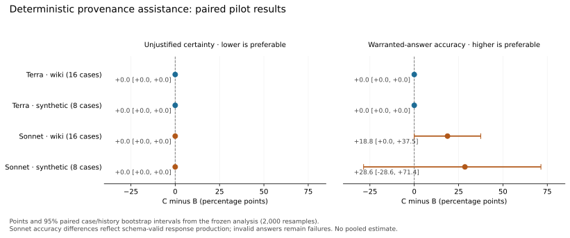

# Investigator utility under a bounded evidence contract

**Review-informed exploratory follow-up; not a preregistered discovery.**

Execution status: **completed**.

The primary contrast is C minus B: raw evidence plus the same strong checklist, with versus without deterministic provenance assistance. A, raw evidence with a competent investigation prompt, is a secondary baseline. Results below measure warranted conclusions under the supplied evidence contract, not recovery of hidden source-use labels or field reliability.

A lower unjustified-certainty rate alone does not establish improvement. Warranted-answer accuracy and schema/citation failures must be considered together; all flat, adverse, and undefined effects remain visible.

## Completed pilot: primary findings

All 144 evaluation requests returned first responses, following 24 development
requests; no transport retries or response repairs were used. Four evaluation
responses were empty content-filter refusals and retain their failure denominators.
The [execution record](../EXECUTION.md), [configuration](../config.json),
[freeze](../frozen/freeze.json), and [response manifest](response_manifest.json)
record the settings, request identities and retained response hashes. The
evaluation freeze was saved at `2026-10-03T20:30:49.922216+00:00`, before the
first evaluation reservation at `2026-10-03T20:31:34.256775+00:00`.

The primary C−B differences below are percentage points with the frozen 95%
paired bootstrap intervals. Wiki and synthetic evidence, and the two models,
remain separate.

| Model / subset | Δ unjustified certainty | Δ warranted-answer accuracy |
|---|---:|---:|
| GPT-5.6 Terra / wiki | 0.00 [0.00, 0.00] | 0.00 [0.00, 0.00] |
| GPT-5.6 Terra / synthetic | 0.00 [0.00, 0.00] | 0.00 [0.00, 0.00] |
| Claude Sonnet 5.5 / wiki | 0.00 [0.00, 0.00] | +18.75 [0.00, +37.50] |
| Claude Sonnet 5.5 / synthetic | 0.00 [0.00, 0.00] | +28.57 [−28.57, +71.43] |

[PNG figure](primary_paired_effects.png) · [Exact estimates](paired_summary.json)

Row labels give total evaluation cases. Both wiki outcomes use all 16 cases;
synthetic unjustified certainty uses five applicable cases and warranted-answer
accuracy uses seven. Cases with no applicable claims have undefined per-case
values for that metric, as specified before evaluation.

Terra produced correct, schema-valid statuses on all 288 evaluation claims
across A/B/C, leaving no observed improvement for assistance. Sonnet produced
216 schema-valid and 72 schema-invalid claim answers; all 216 schema-valid
statuses were correct. Its observed accuracy differences therefore reflect
producing valid responses under the fixed output contract, not correcting
wrong schema-valid conclusions. This pilot does not establish a general
reasoning benefit from the assistance. Every primary interval includes zero;
the zero-width intervals on flat outcomes only reflect this small observed sample.

Sonnet's wiki C−B accuracy gain coincides with fewer invalid claims (B: 16/64;
C: 4/64), but C adds one nonexistent evidence citation. Its wiki C−A accuracy
difference is flat, while B−A is −18.75 points [−37.50, 0.00]. For synthetic
cases, invalid claims decline from 20/32 in B to 12/32 in C, but the case-mean
certainty-or-invalid rate on unresolved claims remains 40% in both arms.
The selected synthetic case `s004` reverses the aggregate accuracy direction:
B is fully valid while C is invalid. These outcomes and the predefined example
selection remain unchanged; no unsuccessful response was retried or repaired.

No schema-valid unjustified certainty was observed. This is not evidence that
malformed answers are safe abstentions: all such answers count as failures,
and the separate certainty-or-invalid diagnostic retains them. The analytic
always-unresolved baseline has zero warranted-answer accuracy on answerable
claims. The [failure diagnostics](failure_diagnostics.json) give overlapping
mechanical error labels, and the [call matrix](call_matrix.csv) gives completion
and cost accounting for every model, split, subset and arm.

## Scope, denominators, and scoring

Wiki and synthetic evidence are reported separately, as is each model. No pooled headline combines those populations. A case's applicable claims are averaged first. Arm estimates and paired differences then average cases; pooled claim counts are shown for auditing the fixed denominators, not substituted for the case-mean estimate.

Unjustified certainty counts schema-valid definite answers to unresolved claims. Warranted-answer accuracy counts schema-valid correct definite answers among answerable claims. Three-class accuracy uses the same status/schema rule. Citation existence is a separate mechanical check and cannot establish semantic evidence support. A correct status can therefore coexist with a citation error. Correct unresolved answers require valid schema and citations; unjustified-certainty-or-invalid counts either definite answers or schema/citation failures on unresolved claims. Missing/invalid output never earns successful-abstention credit. Empty citation lists are allowed. Reasons must be nonempty strings of at most 400 characters. Explanations are not scored semantically and are never graded or repaired by another LLM.

Missing/duplicate expected claims invalidate those claims. Malformed roots, unknown claim IDs, extra root fields, and mismatched case IDs invalidate the response. Missing responses use the same frozen claim denominators; they are not dropped.

Paired percentile intervals use 2000 bootstrap resamples and seed `73021`. Whole page/history clusters are resampled together, retaining all constituent cases and both arms. Claims, arms, retries, and models are not independent cases. Fewer than two eligible clusters yields an unavailable interval; no applicable claims yields an undefined estimate. These small-sample intervals describe this selected pilot, not guaranteed coverage or general deployment reliability.

## Unjustified certainty (lower is preferable)

| Model | Subset | Arm | Case mean [95% interval] | Claims numerator / denominator | Applicable cases / clusters |
|---|---|---|---:|---:|---:|
| anthropic/claude-sonnet-5.5 | synthetic | A | 0.000 [0.000, 0.000] | 0 / 10 | 5 / 5 |
| anthropic/claude-sonnet-5.5 | synthetic | B | 0.000 [0.000, 0.000] | 0 / 10 | 5 / 5 |
| anthropic/claude-sonnet-5.5 | synthetic | C | 0.000 [0.000, 0.000] | 0 / 10 | 5 / 5 |
| anthropic/claude-sonnet-5.5 | wiki | A | 0.000 [0.000, 0.000] | 0 / 32 | 16 / 16 |
| anthropic/claude-sonnet-5.5 | wiki | B | 0.000 [0.000, 0.000] | 0 / 32 | 16 / 16 |
| anthropic/claude-sonnet-5.5 | wiki | C | 0.000 [0.000, 0.000] | 0 / 32 | 16 / 16 |
| openai/gpt-5.6-terra | synthetic | A | 0.000 [0.000, 0.000] | 0 / 10 | 5 / 5 |
| openai/gpt-5.6-terra | synthetic | B | 0.000 [0.000, 0.000] | 0 / 10 | 5 / 5 |
| openai/gpt-5.6-terra | synthetic | C | 0.000 [0.000, 0.000] | 0 / 10 | 5 / 5 |
| openai/gpt-5.6-terra | wiki | A | 0.000 [0.000, 0.000] | 0 / 32 | 16 / 16 |
| openai/gpt-5.6-terra | wiki | B | 0.000 [0.000, 0.000] | 0 / 32 | 16 / 16 |
| openai/gpt-5.6-terra | wiki | C | 0.000 [0.000, 0.000] | 0 / 32 | 16 / 16 |

## Warranted-answer accuracy (higher is preferable)

| Model | Subset | Arm | Case mean [95% interval] | Claims numerator / denominator | Applicable cases / clusters |
|---|---|---|---:|---:|---:|
| anthropic/claude-sonnet-5.5 | synthetic | A | 0.429 [0.143, 0.714] | 11 / 22 | 7 / 7 |
| anthropic/claude-sonnet-5.5 | synthetic | B | 0.429 [0.143, 0.857] | 8 / 22 | 7 / 7 |
| anthropic/claude-sonnet-5.5 | synthetic | C | 0.714 [0.429, 1.000] | 16 / 22 | 7 / 7 |
| anthropic/claude-sonnet-5.5 | wiki | A | 0.938 [0.812, 1.000] | 30 / 32 | 16 / 16 |
| anthropic/claude-sonnet-5.5 | wiki | B | 0.750 [0.500, 0.938] | 24 / 32 | 16 / 16 |
| anthropic/claude-sonnet-5.5 | wiki | C | 0.938 [0.812, 1.000] | 30 / 32 | 16 / 16 |
| openai/gpt-5.6-terra | synthetic | A | 1.000 [1.000, 1.000] | 22 / 22 | 7 / 7 |
| openai/gpt-5.6-terra | synthetic | B | 1.000 [1.000, 1.000] | 22 / 22 | 7 / 7 |
| openai/gpt-5.6-terra | synthetic | C | 1.000 [1.000, 1.000] | 22 / 22 | 7 / 7 |
| openai/gpt-5.6-terra | wiki | A | 1.000 [1.000, 1.000] | 32 / 32 | 16 / 16 |
| openai/gpt-5.6-terra | wiki | B | 1.000 [1.000, 1.000] | 32 / 32 | 16 / 16 |
| openai/gpt-5.6-terra | wiki | C | 1.000 [1.000, 1.000] | 32 / 32 | 16 / 16 |

## Paired contrasts

C−B is primary. B−A and C−A are secondary. Positive differences indicate an increase in the named rate, including error rates.

| Model | Subset | Contrast | Outcome | Difference [95% interval] | Cases / clusters |
|---|---|---|---|---:|---:|
| anthropic/claude-sonnet-5.5 | synthetic | C-B (primary) | unjustified_certainty | 0.000 [0.000, 0.000] | 5 / 5 |
| anthropic/claude-sonnet-5.5 | synthetic | C-B (primary) | warranted_answer_accuracy | 0.286 [-0.286, 0.714] | 7 / 7 |
| anthropic/claude-sonnet-5.5 | synthetic | C-B (primary) | three_class_accuracy | 0.250 [-0.250, 0.625] | 8 / 8 |
| anthropic/claude-sonnet-5.5 | synthetic | C-B (primary) | correct_unresolved | 0.000 [-0.600, 0.600] | 5 / 5 |
| anthropic/claude-sonnet-5.5 | synthetic | C-B (primary) | invalid_missing_answer_rate | -0.250 [-0.750, 0.250] | 8 / 8 |
| anthropic/claude-sonnet-5.5 | synthetic | C-B (primary) | evidence_citation_error_rate | 0.000 [0.000, 0.000] | 8 / 8 |
| anthropic/claude-sonnet-5.5 | synthetic | C-B (primary) | unjustified_certainty_or_invalid | 0.000 [-0.600, 0.600] | 5 / 5 |
| anthropic/claude-sonnet-5.5 | synthetic | B-A | unjustified_certainty | 0.000 [0.000, 0.000] | 5 / 5 |
| anthropic/claude-sonnet-5.5 | synthetic | B-A | warranted_answer_accuracy | 0.000 [-0.571, 0.571] | 7 / 7 |
| anthropic/claude-sonnet-5.5 | synthetic | B-A | three_class_accuracy | -0.125 [-0.625, 0.375] | 8 / 8 |
| anthropic/claude-sonnet-5.5 | synthetic | B-A | correct_unresolved | 0.200 [-0.400, 0.800] | 5 / 5 |
| anthropic/claude-sonnet-5.5 | synthetic | B-A | invalid_missing_answer_rate | 0.125 [-0.500, 0.625] | 8 / 8 |
| anthropic/claude-sonnet-5.5 | synthetic | B-A | evidence_citation_error_rate | 0.000 [0.000, 0.000] | 8 / 8 |
| anthropic/claude-sonnet-5.5 | synthetic | B-A | unjustified_certainty_or_invalid | -0.200 [-0.800, 0.600] | 5 / 5 |
| anthropic/claude-sonnet-5.5 | synthetic | C-A | unjustified_certainty | 0.000 [0.000, 0.000] | 5 / 5 |
| anthropic/claude-sonnet-5.5 | synthetic | C-A | warranted_answer_accuracy | 0.286 [-0.286, 0.714] | 7 / 7 |
| anthropic/claude-sonnet-5.5 | synthetic | C-A | three_class_accuracy | 0.125 [-0.375, 0.625] | 8 / 8 |
| anthropic/claude-sonnet-5.5 | synthetic | C-A | correct_unresolved | 0.200 [-0.400, 0.800] | 5 / 5 |
| anthropic/claude-sonnet-5.5 | synthetic | C-A | invalid_missing_answer_rate | -0.125 [-0.625, 0.375] | 8 / 8 |
| anthropic/claude-sonnet-5.5 | synthetic | C-A | evidence_citation_error_rate | 0.000 [0.000, 0.000] | 8 / 8 |
| anthropic/claude-sonnet-5.5 | synthetic | C-A | unjustified_certainty_or_invalid | -0.200 [-0.800, 0.400] | 5 / 5 |
| anthropic/claude-sonnet-5.5 | wiki | C-B (primary) | unjustified_certainty | 0.000 [0.000, 0.000] | 16 / 16 |
| anthropic/claude-sonnet-5.5 | wiki | C-B (primary) | warranted_answer_accuracy | 0.188 [0.000, 0.375] | 16 / 16 |
| anthropic/claude-sonnet-5.5 | wiki | C-B (primary) | three_class_accuracy | 0.188 [0.000, 0.375] | 16 / 16 |
| anthropic/claude-sonnet-5.5 | wiki | C-B (primary) | correct_unresolved | 0.156 [0.000, 0.344] | 16 / 16 |
| anthropic/claude-sonnet-5.5 | wiki | C-B (primary) | invalid_missing_answer_rate | -0.188 [-0.375, 0.000] | 16 / 16 |
| anthropic/claude-sonnet-5.5 | wiki | C-B (primary) | evidence_citation_error_rate | 0.016 [0.000, 0.047] | 16 / 16 |
| anthropic/claude-sonnet-5.5 | wiki | C-B (primary) | unjustified_certainty_or_invalid | -0.156 [-0.344, 0.000] | 16 / 16 |
| anthropic/claude-sonnet-5.5 | wiki | B-A | unjustified_certainty | 0.000 [0.000, 0.000] | 16 / 16 |
| anthropic/claude-sonnet-5.5 | wiki | B-A | warranted_answer_accuracy | -0.188 [-0.375, 0.000] | 16 / 16 |
| anthropic/claude-sonnet-5.5 | wiki | B-A | three_class_accuracy | -0.188 [-0.375, 0.000] | 16 / 16 |
| anthropic/claude-sonnet-5.5 | wiki | B-A | correct_unresolved | -0.188 [-0.375, 0.000] | 16 / 16 |
| anthropic/claude-sonnet-5.5 | wiki | B-A | invalid_missing_answer_rate | 0.188 [0.000, 0.375] | 16 / 16 |
| anthropic/claude-sonnet-5.5 | wiki | B-A | evidence_citation_error_rate | 0.000 [0.000, 0.000] | 16 / 16 |
| anthropic/claude-sonnet-5.5 | wiki | B-A | unjustified_certainty_or_invalid | 0.188 [0.000, 0.375] | 16 / 16 |
| anthropic/claude-sonnet-5.5 | wiki | C-A | unjustified_certainty | 0.000 [0.000, 0.000] | 16 / 16 |
| anthropic/claude-sonnet-5.5 | wiki | C-A | warranted_answer_accuracy | 0.000 [-0.188, 0.188] | 16 / 16 |
| anthropic/claude-sonnet-5.5 | wiki | C-A | three_class_accuracy | 0.000 [-0.188, 0.188] | 16 / 16 |
| anthropic/claude-sonnet-5.5 | wiki | C-A | correct_unresolved | -0.031 [-0.188, 0.094] | 16 / 16 |
| anthropic/claude-sonnet-5.5 | wiki | C-A | invalid_missing_answer_rate | 0.000 [-0.188, 0.188] | 16 / 16 |
| anthropic/claude-sonnet-5.5 | wiki | C-A | evidence_citation_error_rate | 0.016 [0.000, 0.047] | 16 / 16 |
| anthropic/claude-sonnet-5.5 | wiki | C-A | unjustified_certainty_or_invalid | 0.031 [-0.094, 0.188] | 16 / 16 |
| openai/gpt-5.6-terra | synthetic | C-B (primary) | unjustified_certainty | 0.000 [0.000, 0.000] | 5 / 5 |
| openai/gpt-5.6-terra | synthetic | C-B (primary) | warranted_answer_accuracy | 0.000 [0.000, 0.000] | 7 / 7 |
| openai/gpt-5.6-terra | synthetic | C-B (primary) | three_class_accuracy | 0.000 [0.000, 0.000] | 8 / 8 |
| openai/gpt-5.6-terra | synthetic | C-B (primary) | correct_unresolved | 0.000 [0.000, 0.000] | 5 / 5 |
| openai/gpt-5.6-terra | synthetic | C-B (primary) | invalid_missing_answer_rate | 0.000 [0.000, 0.000] | 8 / 8 |
| openai/gpt-5.6-terra | synthetic | C-B (primary) | evidence_citation_error_rate | 0.000 [0.000, 0.000] | 8 / 8 |
| openai/gpt-5.6-terra | synthetic | C-B (primary) | unjustified_certainty_or_invalid | 0.000 [0.000, 0.000] | 5 / 5 |
| openai/gpt-5.6-terra | synthetic | B-A | unjustified_certainty | 0.000 [0.000, 0.000] | 5 / 5 |
| openai/gpt-5.6-terra | synthetic | B-A | warranted_answer_accuracy | 0.000 [0.000, 0.000] | 7 / 7 |
| openai/gpt-5.6-terra | synthetic | B-A | three_class_accuracy | 0.000 [0.000, 0.000] | 8 / 8 |
| openai/gpt-5.6-terra | synthetic | B-A | correct_unresolved | 0.000 [0.000, 0.000] | 5 / 5 |
| openai/gpt-5.6-terra | synthetic | B-A | invalid_missing_answer_rate | 0.000 [0.000, 0.000] | 8 / 8 |
| openai/gpt-5.6-terra | synthetic | B-A | evidence_citation_error_rate | 0.000 [0.000, 0.000] | 8 / 8 |
| openai/gpt-5.6-terra | synthetic | B-A | unjustified_certainty_or_invalid | 0.000 [0.000, 0.000] | 5 / 5 |
| openai/gpt-5.6-terra | synthetic | C-A | unjustified_certainty | 0.000 [0.000, 0.000] | 5 / 5 |
| openai/gpt-5.6-terra | synthetic | C-A | warranted_answer_accuracy | 0.000 [0.000, 0.000] | 7 / 7 |
| openai/gpt-5.6-terra | synthetic | C-A | three_class_accuracy | 0.000 [0.000, 0.000] | 8 / 8 |
| openai/gpt-5.6-terra | synthetic | C-A | correct_unresolved | 0.000 [0.000, 0.000] | 5 / 5 |
| openai/gpt-5.6-terra | synthetic | C-A | invalid_missing_answer_rate | 0.000 [0.000, 0.000] | 8 / 8 |
| openai/gpt-5.6-terra | synthetic | C-A | evidence_citation_error_rate | 0.000 [0.000, 0.000] | 8 / 8 |
| openai/gpt-5.6-terra | synthetic | C-A | unjustified_certainty_or_invalid | 0.000 [0.000, 0.000] | 5 / 5 |
| openai/gpt-5.6-terra | wiki | C-B (primary) | unjustified_certainty | 0.000 [0.000, 0.000] | 16 / 16 |
| openai/gpt-5.6-terra | wiki | C-B (primary) | warranted_answer_accuracy | 0.000 [0.000, 0.000] | 16 / 16 |
| openai/gpt-5.6-terra | wiki | C-B (primary) | three_class_accuracy | 0.000 [0.000, 0.000] | 16 / 16 |
| openai/gpt-5.6-terra | wiki | C-B (primary) | correct_unresolved | 0.000 [0.000, 0.000] | 16 / 16 |
| openai/gpt-5.6-terra | wiki | C-B (primary) | invalid_missing_answer_rate | 0.000 [0.000, 0.000] | 16 / 16 |
| openai/gpt-5.6-terra | wiki | C-B (primary) | evidence_citation_error_rate | 0.000 [0.000, 0.000] | 16 / 16 |
| openai/gpt-5.6-terra | wiki | C-B (primary) | unjustified_certainty_or_invalid | 0.000 [0.000, 0.000] | 16 / 16 |
| openai/gpt-5.6-terra | wiki | B-A | unjustified_certainty | 0.000 [0.000, 0.000] | 16 / 16 |
| openai/gpt-5.6-terra | wiki | B-A | warranted_answer_accuracy | 0.000 [0.000, 0.000] | 16 / 16 |
| openai/gpt-5.6-terra | wiki | B-A | three_class_accuracy | 0.000 [0.000, 0.000] | 16 / 16 |
| openai/gpt-5.6-terra | wiki | B-A | correct_unresolved | 0.000 [0.000, 0.000] | 16 / 16 |
| openai/gpt-5.6-terra | wiki | B-A | invalid_missing_answer_rate | 0.000 [0.000, 0.000] | 16 / 16 |
| openai/gpt-5.6-terra | wiki | B-A | evidence_citation_error_rate | 0.000 [0.000, 0.000] | 16 / 16 |
| openai/gpt-5.6-terra | wiki | B-A | unjustified_certainty_or_invalid | 0.000 [0.000, 0.000] | 16 / 16 |
| openai/gpt-5.6-terra | wiki | C-A | unjustified_certainty | 0.000 [0.000, 0.000] | 16 / 16 |
| openai/gpt-5.6-terra | wiki | C-A | warranted_answer_accuracy | 0.000 [0.000, 0.000] | 16 / 16 |
| openai/gpt-5.6-terra | wiki | C-A | three_class_accuracy | 0.000 [0.000, 0.000] | 16 / 16 |
| openai/gpt-5.6-terra | wiki | C-A | correct_unresolved | 0.000 [0.000, 0.000] | 16 / 16 |
| openai/gpt-5.6-terra | wiki | C-A | invalid_missing_answer_rate | 0.000 [0.000, 0.000] | 16 / 16 |
| openai/gpt-5.6-terra | wiki | C-A | evidence_citation_error_rate | 0.000 [0.000, 0.000] | 16 / 16 |
| openai/gpt-5.6-terra | wiki | C-A | unjustified_certainty_or_invalid | 0.000 [0.000, 0.000] | 16 / 16 |

## Accuracy, abstention, and failure diagnostics

Entries give case means followed by pooled numerator/denominator counts.

| Model | Subset | Arm | Three-class accuracy | Correct unresolved | Schema/missing failure | Citation error | Certainty or invalid on unresolved |
|---|---|---|---:|---:|---:|---:|---:|
| anthropic/claude-sonnet-5.5 | synthetic | A | 0.500 (16/32) | 0.400 (5/10) | 0.500 (16/32) | 0.000 (0/32) | 0.600 (5/10) |
| anthropic/claude-sonnet-5.5 | synthetic | B | 0.375 (12/32) | 0.600 (4/10) | 0.625 (20/32) | 0.000 (0/32) | 0.400 (6/10) |
| anthropic/claude-sonnet-5.5 | synthetic | C | 0.625 (20/32) | 0.600 (4/10) | 0.375 (12/32) | 0.000 (0/32) | 0.400 (6/10) |
| anthropic/claude-sonnet-5.5 | wiki | A | 0.938 (60/64) | 0.938 (30/32) | 0.062 (4/64) | 0.000 (0/64) | 0.062 (2/32) |
| anthropic/claude-sonnet-5.5 | wiki | B | 0.750 (48/64) | 0.750 (24/32) | 0.250 (16/64) | 0.000 (0/64) | 0.250 (8/32) |
| anthropic/claude-sonnet-5.5 | wiki | C | 0.938 (60/64) | 0.906 (29/32) | 0.062 (4/64) | 0.016 (1/64) | 0.094 (3/32) |
| openai/gpt-5.6-terra | synthetic | A | 1.000 (32/32) | 1.000 (10/10) | 0.000 (0/32) | 0.000 (0/32) | 0.000 (0/10) |
| openai/gpt-5.6-terra | synthetic | B | 1.000 (32/32) | 1.000 (10/10) | 0.000 (0/32) | 0.000 (0/32) | 0.000 (0/10) |
| openai/gpt-5.6-terra | synthetic | C | 1.000 (32/32) | 1.000 (10/10) | 0.000 (0/32) | 0.000 (0/32) | 0.000 (0/10) |
| openai/gpt-5.6-terra | wiki | A | 1.000 (64/64) | 1.000 (32/32) | 0.000 (0/64) | 0.000 (0/64) | 0.000 (0/32) |
| openai/gpt-5.6-terra | wiki | B | 1.000 (64/64) | 1.000 (32/32) | 0.000 (0/64) | 0.000 (0/64) | 0.000 (0/32) |
| openai/gpt-5.6-terra | wiki | C | 1.000 (64/64) | 1.000 (32/32) | 0.000 (0/64) | 0.000 (0/64) | 0.000 (0/32) |

## Analytic constant-answer sanity baselines

These are deterministic scoring checks with no API calls, not investigator evaluations. Always-unresolved can avoid definite errors but has zero warranted-answer accuracy whenever answerable claims exist.

| Baseline | Subset | Cases | Unjustified certainty | Warranted-answer accuracy | Three-class accuracy |
|---|---|---:|---:|---:|---:|
| always_established | synthetic | 8 | 1.000 (10/10) | 0.679 (13/22) | 0.406 (13/32) |
| always_established | wiki | 16 | 1.000 (32/32) | 0.531 (17/32) | 0.266 (17/64) |
| always_ruled_out | synthetic | 8 | 1.000 (10/10) | 0.321 (9/22) | 0.281 (9/32) |
| always_ruled_out | wiki | 16 | 1.000 (32/32) | 0.469 (15/32) | 0.234 (15/64) |
| always_unresolved | synthetic | 8 | 0.000 (0/10) | 0.000 (0/22) | 0.312 (10/32) |
| always_unresolved | wiki | 16 | 0.000 (0/32) | 0.000 (0/32) | 0.500 (32/64) |

## Frozen-rule examples

For each model/subset, select the lowest SHA-256(case ID) among eligible C/B improvements, and separately among unsuccessful or disagreeing cases. Improvement requires a favorable primary change with no primary deterioration or increase in schema/citation failure. Examples illustrate selected-case behavior, not prevalence.

- anthropic/claude-sonnet-5.5, synthetic, improvement: `s005`; Δ unjustified certainty undefined, Δ warranted-answer accuracy 1.000. See per-case scores and the saved first completion for the full record.
- anthropic/claude-sonnet-5.5, synthetic, unsuccessful_or_disagreeing: `s004`; Δ unjustified certainty 0.000, Δ warranted-answer accuracy -1.000. See per-case scores and the saved first completion for the full record.
- anthropic/claude-sonnet-5.5, wiki, improvement: `wiki_028b2268bbdc10a0`; Δ unjustified certainty 0.000, Δ warranted-answer accuracy 1.000. See per-case scores and the saved first completion for the full record.
- anthropic/claude-sonnet-5.5, wiki, unsuccessful_or_disagreeing: `wiki_0252f85ad8d798a1`; Δ unjustified certainty 0.000, Δ warranted-answer accuracy 1.000. See per-case scores and the saved first completion for the full record.
- openai/gpt-5.6-terra, synthetic, improvement: No qualifying paired case exists.
- openai/gpt-5.6-terra, synthetic, unsuccessful_or_disagreeing: No qualifying paired case exists.
- openai/gpt-5.6-terra, wiki, improvement: No qualifying paired case exists.
- openai/gpt-5.6-terra, wiki, unsuccessful_or_disagreeing: No qualifying paired case exists.

## Calls, cost, and preservation

- Development calls completed: 24.
- Evaluation calls completed: 144.
- Transport-only retry attempts: 0.
- Total potentially billable attempts: 168.
- Known provider-reported charges (USD): 2.8615140 across 167 attempts.
- Actual whole-study model cost (USD): unknown; one refusal omitted usage metadata.
- Conservatively charged/reserved cost (USD): 2.9989060.
- Preserved-artifact hash verification: All 70 baseline tracked-file hashes match.

Sonnet B on `wiki_0252f85ad8d798a1` returned `content_filter` / `refusal`, null
content and no usage metadata. Its first response is final and its full
$0.137392 reservation remains held. The known charge total plus this reservation
is $2.9989060, below the $25 whole-study ceiling. The separate $2.8636290
token-pricing estimate for 167 attempts uses the conservative cache-inclusive
input rate; it is neither an invoice nor the provider-reported charge sum.
The pre-call bound for all requests and the retry allowance was $24.056916.
All prior costs and responses remain in the original append-only ledger.

The existing suite passed **431 tests** and Ruff before inference. All 106
originally tracked files and the three prepared inputs also match the snapshot
taken before execution. These checks establish preservation and mechanical
properties; they are not research discoveries. No harness, prompt, case,
selection rule, certificate, scoring rule or prior curated result was changed.

## Limits

The evaluation contract concerns supplied evidence and explicitly bounded assumptions. Public wiki history is incomplete incident history; literal text insertion does not establish intent, exposure, stable actor identity, or source use. Public-corpus model contamination cannot be ruled out. Synthetic compatible constructions are not additional independent cases. Gold derivations and leakage checks are mechanical/AI-assisted unless a separately recorded real human review exists. Evidence-ID existence is not a semantic rationale check. Small selected case counts, shared histories, model availability, and resource failures limit inference. The three completed studies retain their original protocols, estimands, and curated results.

The request model IDs are aliases, not immutable dated model revisions. Provider
identities and source metadata are recorded without claiming fixed model weights.
Full raw records and responses remain in ignored local artifacts, so the public
manifests support integrity checks but do not alone reproduce private response
contents. A single response per case/arm/model does not measure repeatability.
