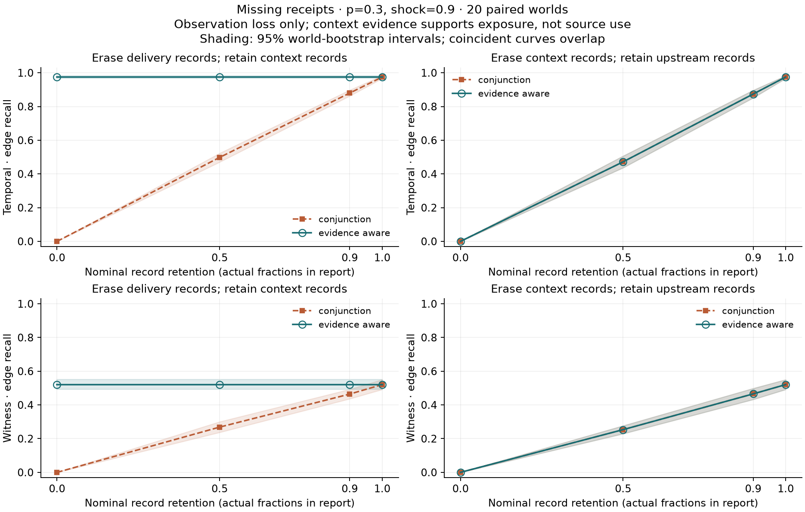

# Missing-receipt follow-up stress test

**Follow-up informed by baseline review; not a preregistered discovery. All results are synthetic.**

The target remains direct, realized cross-run source selection by the structural simulator. The eligible denominator is every generated write, including initial writes. Exposure is not source use, and selected source use is not counterfactual necessity.

## Frozen configuration and pairing

Reviewed baseline: `36be8fa3682b294462ac65f8c2f750119e75cdb2`. The original simulator, analysis plan and curated `results/` artifacts are preserved.

- World seeds: `[200, 201, 202, 203, 204, 205, 206, 207, 208, 209, 210, 211, 212, 213, 214, 215, 216, 217, 218, 219]`; 120 runs × 3 writes per world.
- Transmission parameters: `[0, 0.3]`; shock: `[0.9]`; nominal retention: `[1, 0.9, 0.5, 0]`.
- 40 worlds, 320 masked observations, 1280 policy/method evaluations. Each world is generated once before all receipt masks.
- Mask seed: `mask_seed_base + world_seed; reused across retention levels`. Per-record deterministic ranks are shared across retention levels, producing nested retained sets. No mask is an extra world.
- Request records, writes, identities, truth edges and eligible targets are fixed. The unmodified generator still permits genuine request/delivery/context failure and unused exposure. No generation probability is changed to model log loss.
- Freeze evidence: `{'status': 'Frozen after correctness tests, before the bounded 120-run experiment', 'passed_tests': 124, 'command': 'MPLCONFIGDIR=/workspace/.cache/matplotlib .venv/bin/pytest -q', 'review': 'Independent read-only review found no blocker for the bounded loss-only experiment.', 'fixture_note': 'Early correctness fixtures used seeds 211/213 with 30 runs; they were moved to 41/43 before freeze. No 120-run follow-up world was evaluated before freeze. This is not claimed to be preregistered or untouched holdout evaluation.'}`.
- Configuration SHA-256: `d86e206f492ac66c5a55f508f02553b6ba8ee50469b600f201ecbd4aa98e63a2`.

For each method/profile/retention/transmission/shock combination, policies receive the identical masked observation. Policy differences are computed within each world before a 95% percentile bootstrap (2000 resamples). Summaries group every study dimension. Undefined values stay null and undefined pairs do not contribute to their metric's interval. Counts of defined worlds are in `study.json`. No edges, masks, methods or profiles are treated as independent worlds.

## Evidence policies and assumptions

- **Conjunction:** the existing filter is retained exactly. It requires a compatible request, delivery and context entry. Missing any stage rejects a candidate. Its zero unresolved burden reflects lack of an abstention category, not resolved knowledge.
- **Evidence aware:** a trusted, semantically valid context-entry receipt supports exposure without an upstream receipt. Missing context excludes exposure only when context logging is declared complete, or complete relevant upstream logging rules out the required prior event. Otherwise exposure is unknown.
- Authentication is an explicit coarse trust assumption about retained simulator receipts, not implemented cryptography. Source ID, recipient identity, event timing and recorded source content are checked; absent upstream records are not failures. Malformed or contradictory evidence is outside the loss-only experiment.
- Completeness assurance is channel-wide and declared from the logging profile. Below nominal retention 1 the affected stream is declared incomplete even when a particular mask happens to retain every record. Investigators receive no per-edge loss labels, truth, original record counts or mask seed.
- Both methods start with the same stable-identity candidate universe. Supported exposure plus the temporal/witness heuristic yields a **scored candidate**, never a verified source-use edge. Unknown candidates are not added to predictions.

## Recall versus record retention



The figure shows the positive-use condition. In the zero-use control recall is undefined, not zero. Actual record fractions are tabulated below.

## Actual retained records

Each row counts each masked world once, independent of the number of policies and methods applied. Fractions below are pooled retained/original record counts over the worlds in that scenario; per-world fractions and counts are in `retention.csv`.

| p | Profile | Nominal retention | Delivery kept / original (fraction) | Context kept / original (fraction) | Requests kept / original |
|---:|---|---:|---:|---:|---:|
| 0 | drop_delivery | 1 | 4613 / 4613 (1.0000) | 3660 / 3660 (1.0000) | 5697 / 5697 (1.0000) |
| 0 | drop_delivery | 0.9 | 4125 / 4613 (0.8942) | 3660 / 3660 (1.0000) | 5697 / 5697 (1.0000) |
| 0 | drop_delivery | 0.5 | 2253 / 4613 (0.4884) | 3660 / 3660 (1.0000) | 5697 / 5697 (1.0000) |
| 0 | drop_delivery | 0 | 0 / 4613 (0.0000) | 3660 / 3660 (1.0000) | 5697 / 5697 (1.0000) |
| 0 | drop_context | 1 | 4613 / 4613 (1.0000) | 3660 / 3660 (1.0000) | 5697 / 5697 (1.0000) |
| 0 | drop_context | 0.9 | 4613 / 4613 (1.0000) | 3288 / 3660 (0.8984) | 5697 / 5697 (1.0000) |
| 0 | drop_context | 0.5 | 4613 / 4613 (1.0000) | 1821 / 3660 (0.4975) | 5697 / 5697 (1.0000) |
| 0 | drop_context | 0 | 4613 / 4613 (1.0000) | 0 / 3660 (0.0000) | 5697 / 5697 (1.0000) |
| 0.3 | drop_delivery | 1 | 4587 / 4587 (1.0000) | 3686 / 3686 (1.0000) | 5778 / 5778 (1.0000) |
| 0.3 | drop_delivery | 0.9 | 4148 / 4587 (0.9043) | 3686 / 3686 (1.0000) | 5778 / 5778 (1.0000) |
| 0.3 | drop_delivery | 0.5 | 2292 / 4587 (0.4997) | 3686 / 3686 (1.0000) | 5778 / 5778 (1.0000) |
| 0.3 | drop_delivery | 0 | 0 / 4587 (0.0000) | 3686 / 3686 (1.0000) | 5778 / 5778 (1.0000) |
| 0.3 | drop_context | 1 | 4587 / 4587 (1.0000) | 3686 / 3686 (1.0000) | 5778 / 5778 (1.0000) |
| 0.3 | drop_context | 0.9 | 4587 / 4587 (1.0000) | 3324 / 3686 (0.9018) | 5778 / 5778 (1.0000) |
| 0.3 | drop_context | 0.5 | 4587 / 4587 (1.0000) | 1800 / 3686 (0.4883) | 5778 / 5778 (1.0000) |
| 0.3 | drop_context | 0 | 4587 / 4587 (1.0000) | 0 / 3686 (0.0000) | 5778 / 5778 (1.0000) |

## Measured attribution and unresolved burden

All entries below are means across worlds. Precision/recall concern **edges**. FP/N counts targets with a prediction but no true cross-run source. FN counts true source-use targets with no predicted candidate. Wrong-source attribution to a truly copied target instead appears in edge errors. Signed error is θ̂−θ; target disagreement is (FP+FN)/N. Thus signed error can be small through cancellation.

Unknown/N counts targets with at least one unresolved candidate, divided by all writes. Such a target may also have a supported candidate from a different source. This burden is not a count of additional verified source-use targets. Edge-level unknown counts/fractions and all edge errors remain in JSON/CSV.

### Transmission parameter 0

| Profile | Retention | Method | Policy | Recall | Precision | FP targets | FN targets | FP/N | Signed θ error | Disagreement | Unknown/N |
|---|---:|---|---|---:|---:|---:|---:|---:|---:|---:|---:|
| drop_delivery | 1 | temporal | conjunction | undefined | 0.000 | 253.000 | 0.000 | 0.703 | 0.703 | 0.703 | 0.000 |
| drop_delivery | 1 | temporal | evidence_aware | undefined | 0.000 | 253.000 | 0.000 | 0.703 | 0.703 | 0.703 | 0.000 |
| drop_delivery | 1 | witness | conjunction | undefined | 0.000 | 5.700 | 0.000 | 0.016 | 0.016 | 0.016 | 0.000 |
| drop_delivery | 1 | witness | evidence_aware | undefined | 0.000 | 5.700 | 0.000 | 0.016 | 0.016 | 0.016 | 0.000 |
| drop_delivery | 0.9 | temporal | conjunction | undefined | 0.000 | 234.200 | 0.000 | 0.651 | 0.651 | 0.651 | 0.000 |
| drop_delivery | 0.9 | temporal | evidence_aware | undefined | 0.000 | 253.000 | 0.000 | 0.703 | 0.703 | 0.703 | 0.000 |
| drop_delivery | 0.9 | witness | conjunction | undefined | 0.000 | 5.250 | 0.000 | 0.015 | 0.015 | 0.015 | 0.000 |
| drop_delivery | 0.9 | witness | evidence_aware | undefined | 0.000 | 5.700 | 0.000 | 0.016 | 0.016 | 0.016 | 0.000 |
| drop_delivery | 0.5 | temporal | conjunction | undefined | 0.000 | 143.800 | 0.000 | 0.399 | 0.399 | 0.399 | 0.000 |
| drop_delivery | 0.5 | temporal | evidence_aware | undefined | 0.000 | 253.000 | 0.000 | 0.703 | 0.703 | 0.703 | 0.000 |
| drop_delivery | 0.5 | witness | conjunction | undefined | 0.000 | 3.000 | 0.000 | 0.008 | 0.008 | 0.008 | 0.000 |
| drop_delivery | 0.5 | witness | evidence_aware | undefined | 0.000 | 5.700 | 0.000 | 0.016 | 0.016 | 0.016 | 0.000 |
| drop_delivery | 0 | temporal | conjunction | undefined | undefined | 0.000 | 0.000 | 0.000 | 0.000 | 0.000 | 0.000 |
| drop_delivery | 0 | temporal | evidence_aware | undefined | 0.000 | 253.000 | 0.000 | 0.703 | 0.703 | 0.703 | 0.000 |
| drop_delivery | 0 | witness | conjunction | undefined | undefined | 0.000 | 0.000 | 0.000 | 0.000 | 0.000 | 0.000 |
| drop_delivery | 0 | witness | evidence_aware | undefined | 0.000 | 5.700 | 0.000 | 0.016 | 0.016 | 0.016 | 0.000 |
| drop_context | 1 | temporal | conjunction | undefined | 0.000 | 253.000 | 0.000 | 0.703 | 0.703 | 0.703 | 0.000 |
| drop_context | 1 | temporal | evidence_aware | undefined | 0.000 | 253.000 | 0.000 | 0.703 | 0.703 | 0.703 | 0.000 |
| drop_context | 1 | witness | conjunction | undefined | 0.000 | 5.700 | 0.000 | 0.016 | 0.016 | 0.016 | 0.000 |
| drop_context | 1 | witness | evidence_aware | undefined | 0.000 | 5.700 | 0.000 | 0.016 | 0.016 | 0.016 | 0.000 |
| drop_context | 0.9 | temporal | conjunction | undefined | 0.000 | 234.900 | 0.000 | 0.653 | 0.653 | 0.653 | 0.000 |
| drop_context | 0.9 | temporal | evidence_aware | undefined | 0.000 | 234.900 | 0.000 | 0.653 | 0.653 | 0.653 | 0.312 |
| drop_context | 0.9 | witness | conjunction | undefined | 0.000 | 5.450 | 0.000 | 0.015 | 0.015 | 0.015 | 0.000 |
| drop_context | 0.9 | witness | evidence_aware | undefined | 0.000 | 5.450 | 0.000 | 0.015 | 0.015 | 0.015 | 0.005 |
| drop_context | 0.5 | temporal | conjunction | undefined | 0.000 | 148.950 | 0.000 | 0.414 | 0.414 | 0.414 | 0.000 |
| drop_context | 0.5 | temporal | evidence_aware | undefined | 0.000 | 148.950 | 0.000 | 0.414 | 0.414 | 0.414 | 0.586 |
| drop_context | 0.5 | witness | conjunction | undefined | 0.000 | 3.400 | 0.000 | 0.009 | 0.009 | 0.009 | 0.000 |
| drop_context | 0.5 | witness | evidence_aware | undefined | 0.000 | 3.400 | 0.000 | 0.009 | 0.009 | 0.009 | 0.011 |
| drop_context | 0 | temporal | conjunction | undefined | undefined | 0.000 | 0.000 | 0.000 | 0.000 | 0.000 | 0.000 |
| drop_context | 0 | temporal | evidence_aware | undefined | undefined | 0.000 | 0.000 | 0.000 | 0.000 | 0.000 | 0.812 |
| drop_context | 0 | witness | conjunction | undefined | undefined | 0.000 | 0.000 | 0.000 | 0.000 | 0.000 | 0.000 |
| drop_context | 0 | witness | evidence_aware | undefined | undefined | 0.000 | 0.000 | 0.000 | 0.000 | 0.000 | 0.020 |

### Transmission parameter 0.3

| Profile | Retention | Method | Policy | Recall | Precision | FP targets | FN targets | FP/N | Signed θ error | Disagreement | Unknown/N |
|---|---:|---|---|---:|---:|---:|---:|---:|---:|---:|---:|
| drop_delivery | 1 | temporal | conjunction | 0.975 | 0.177 | 192.200 | 0.800 | 0.534 | 0.532 | 0.536 | 0.000 |
| drop_delivery | 1 | temporal | evidence_aware | 0.975 | 0.177 | 192.200 | 0.800 | 0.534 | 0.532 | 0.536 | 0.000 |
| drop_delivery | 1 | witness | conjunction | 0.521 | 0.795 | 7.750 | 30.300 | 0.022 | -0.063 | 0.106 | 0.000 |
| drop_delivery | 1 | witness | evidence_aware | 0.521 | 0.795 | 7.750 | 30.300 | 0.022 | -0.063 | 0.106 | 0.000 |
| drop_delivery | 0.9 | temporal | conjunction | 0.880 | 0.176 | 179.350 | 5.150 | 0.498 | 0.484 | 0.512 | 0.000 |
| drop_delivery | 0.9 | temporal | evidence_aware | 0.975 | 0.177 | 192.200 | 0.800 | 0.534 | 0.532 | 0.536 | 0.000 |
| drop_delivery | 0.9 | witness | conjunction | 0.464 | 0.799 | 6.850 | 33.950 | 0.019 | -0.075 | 0.113 | 0.000 |
| drop_delivery | 0.9 | witness | evidence_aware | 0.521 | 0.795 | 7.750 | 30.300 | 0.022 | -0.063 | 0.106 | 0.000 |
| drop_delivery | 0.5 | temporal | conjunction | 0.498 | 0.180 | 112.700 | 26.350 | 0.313 | 0.240 | 0.386 | 0.000 |
| drop_delivery | 0.5 | temporal | evidence_aware | 0.975 | 0.177 | 192.200 | 0.800 | 0.534 | 0.532 | 0.536 | 0.000 |
| drop_delivery | 0.5 | witness | conjunction | 0.268 | 0.809 | 3.650 | 46.300 | 0.010 | -0.118 | 0.139 | 0.000 |
| drop_delivery | 0.5 | witness | evidence_aware | 0.521 | 0.795 | 7.750 | 30.300 | 0.022 | -0.063 | 0.106 | 0.000 |
| drop_delivery | 0 | temporal | conjunction | 0.000 | undefined | 0.000 | 63.700 | 0.000 | -0.177 | 0.177 | 0.000 |
| drop_delivery | 0 | temporal | evidence_aware | 0.975 | 0.177 | 192.200 | 0.800 | 0.534 | 0.532 | 0.536 | 0.000 |
| drop_delivery | 0 | witness | conjunction | 0.000 | undefined | 0.000 | 63.700 | 0.000 | -0.177 | 0.177 | 0.000 |
| drop_delivery | 0 | witness | evidence_aware | 0.521 | 0.795 | 7.750 | 30.300 | 0.022 | -0.063 | 0.106 | 0.000 |
| drop_context | 1 | temporal | conjunction | 0.975 | 0.177 | 192.200 | 0.800 | 0.534 | 0.532 | 0.536 | 0.000 |
| drop_context | 1 | temporal | evidence_aware | 0.975 | 0.177 | 192.200 | 0.800 | 0.534 | 0.532 | 0.536 | 0.000 |
| drop_context | 1 | witness | conjunction | 0.521 | 0.795 | 7.750 | 30.300 | 0.022 | -0.063 | 0.106 | 0.000 |
| drop_context | 1 | witness | evidence_aware | 0.521 | 0.795 | 7.750 | 30.300 | 0.022 | -0.063 | 0.106 | 0.000 |
| drop_context | 0.9 | temporal | conjunction | 0.874 | 0.176 | 179.450 | 5.200 | 0.498 | 0.484 | 0.513 | 0.000 |
| drop_context | 0.9 | temporal | evidence_aware | 0.874 | 0.176 | 179.450 | 5.200 | 0.498 | 0.484 | 0.513 | 0.304 |
| drop_context | 0.9 | witness | conjunction | 0.466 | 0.793 | 7.050 | 33.800 | 0.020 | -0.074 | 0.113 | 0.000 |
| drop_context | 0.9 | witness | evidence_aware | 0.466 | 0.793 | 7.050 | 33.800 | 0.020 | -0.074 | 0.113 | 0.018 |
| drop_context | 0.5 | temporal | conjunction | 0.472 | 0.177 | 110.200 | 27.900 | 0.306 | 0.229 | 0.384 | 0.000 |
| drop_context | 0.5 | temporal | evidence_aware | 0.472 | 0.177 | 110.200 | 27.900 | 0.306 | 0.229 | 0.384 | 0.584 |
| drop_context | 0.5 | witness | conjunction | 0.253 | 0.810 | 3.550 | 47.450 | 0.010 | -0.122 | 0.142 | 0.000 |
| drop_context | 0.5 | witness | evidence_aware | 0.253 | 0.810 | 3.550 | 47.450 | 0.010 | -0.122 | 0.142 | 0.065 |
| drop_context | 0 | temporal | conjunction | 0.000 | undefined | 0.000 | 63.700 | 0.000 | -0.177 | 0.177 | 0.000 |
| drop_context | 0 | temporal | evidence_aware | 0.000 | undefined | 0.000 | 63.700 | 0.000 | -0.177 | 0.177 | 0.811 |
| drop_context | 0 | witness | conjunction | 0.000 | undefined | 0.000 | 63.700 | 0.000 | -0.177 | 0.177 | 0.000 |
| drop_context | 0 | witness | evidence_aware | 0.000 | undefined | 0.000 | 63.700 | 0.000 | -0.177 | 0.177 | 0.119 |

## Paired policy differences

**Evidence aware minus conjunction**, computed within each fixed world and masked observation; brackets are 95% world-bootstrap intervals. Zero, negative and reversed differences are reported without selecting favorable comparisons. Positive recall is higher coverage; positive false attribution or disagreement is more error. Signed-error differences have no universal better direction. Positive unknown burden exposes uncertainty the conjunction baseline does not represent.

| p | Profile | Retention | Method | Δ recall | Δ FP/N | Δ signed θ error | Δ disagreement | Δ unknown/N |
|---:|---|---:|---|---:|---:|---:|---:|---:|
| 0 | drop_context | 0 | temporal | undefined (n=0) | 0.000 [0.000, 0.000] | 0.000 [0.000, 0.000] | 0.000 [0.000, 0.000] | 0.812 [0.801, 0.823] |
| 0 | drop_context | 0.5 | temporal | undefined (n=0) | 0.000 [0.000, 0.000] | 0.000 [0.000, 0.000] | 0.000 [0.000, 0.000] | 0.586 [0.573, 0.598] |
| 0 | drop_context | 0.9 | temporal | undefined (n=0) | 0.000 [0.000, 0.000] | 0.000 [0.000, 0.000] | 0.000 [0.000, 0.000] | 0.312 [0.298, 0.325] |
| 0 | drop_context | 1 | temporal | undefined (n=0) | 0.000 [0.000, 0.000] | 0.000 [0.000, 0.000] | 0.000 [0.000, 0.000] | 0.000 [0.000, 0.000] |
| 0 | drop_delivery | 0 | temporal | undefined (n=0) | 0.703 [0.689, 0.715] | 0.703 [0.689, 0.715] | 0.703 [0.689, 0.716] | 0.000 [0.000, 0.000] |
| 0 | drop_delivery | 0.5 | temporal | undefined (n=0) | 0.303 [0.289, 0.316] | 0.303 [0.290, 0.316] | 0.303 [0.290, 0.316] | 0.000 [0.000, 0.000] |
| 0 | drop_delivery | 0.9 | temporal | undefined (n=0) | 0.052 [0.043, 0.061] | 0.052 [0.044, 0.061] | 0.052 [0.043, 0.061] | 0.000 [0.000, 0.000] |
| 0 | drop_delivery | 1 | temporal | undefined (n=0) | 0.000 [0.000, 0.000] | 0.000 [0.000, 0.000] | 0.000 [0.000, 0.000] | 0.000 [0.000, 0.000] |
| 0 | drop_context | 0 | witness | undefined (n=0) | 0.000 [0.000, 0.000] | 0.000 [0.000, 0.000] | 0.000 [0.000, 0.000] | 0.020 [0.016, 0.024] |
| 0 | drop_context | 0.5 | witness | undefined (n=0) | 0.000 [0.000, 0.000] | 0.000 [0.000, 0.000] | 0.000 [0.000, 0.000] | 0.011 [0.008, 0.014] |
| 0 | drop_context | 0.9 | witness | undefined (n=0) | 0.000 [0.000, 0.000] | 0.000 [0.000, 0.000] | 0.000 [0.000, 0.000] | 0.005 [0.004, 0.007] |
| 0 | drop_context | 1 | witness | undefined (n=0) | 0.000 [0.000, 0.000] | 0.000 [0.000, 0.000] | 0.000 [0.000, 0.000] | 0.000 [0.000, 0.000] |
| 0 | drop_delivery | 0 | witness | undefined (n=0) | 0.016 [0.012, 0.020] | 0.016 [0.012, 0.020] | 0.016 [0.012, 0.020] | 0.000 [0.000, 0.000] |
| 0 | drop_delivery | 0.5 | witness | undefined (n=0) | 0.007 [0.005, 0.010] | 0.007 [0.005, 0.010] | 0.007 [0.005, 0.010] | 0.000 [0.000, 0.000] |
| 0 | drop_delivery | 0.9 | witness | undefined (n=0) | 0.001 [0.000, 0.002] | 0.001 [0.000, 0.002] | 0.001 [0.000, 0.002] | 0.000 [0.000, 0.000] |
| 0 | drop_delivery | 1 | witness | undefined (n=0) | 0.000 [0.000, 0.000] | 0.000 [0.000, 0.000] | 0.000 [0.000, 0.000] | 0.000 [0.000, 0.000] |
| 0.3 | drop_context | 0 | temporal | 0.000 [0.000, 0.000] | 0.000 [0.000, 0.000] | 0.000 [0.000, 0.000] | 0.000 [0.000, 0.000] | 0.811 [0.804, 0.818] |
| 0.3 | drop_context | 0.5 | temporal | 0.000 [0.000, 0.000] | 0.000 [0.000, 0.000] | 0.000 [0.000, 0.000] | 0.000 [0.000, 0.000] | 0.584 [0.571, 0.598] |
| 0.3 | drop_context | 0.9 | temporal | 0.000 [0.000, 0.000] | 0.000 [0.000, 0.000] | 0.000 [0.000, 0.000] | 0.000 [0.000, 0.000] | 0.304 [0.289, 0.320] |
| 0.3 | drop_context | 1 | temporal | 0.000 [0.000, 0.000] | 0.000 [0.000, 0.000] | 0.000 [0.000, 0.000] | 0.000 [0.000, 0.000] | 0.000 [0.000, 0.000] |
| 0.3 | drop_delivery | 0 | temporal | 0.975 [0.967, 0.983] | 0.534 [0.523, 0.546] | 0.709 [0.696, 0.720] | 0.359 [0.346, 0.372] | 0.000 [0.000, 0.000] |
| 0.3 | drop_delivery | 0.5 | temporal | 0.477 [0.449, 0.506] | 0.221 [0.210, 0.232] | 0.292 [0.280, 0.305] | 0.150 [0.139, 0.161] | 0.000 [0.000, 0.000] |
| 0.3 | drop_delivery | 0.9 | temporal | 0.095 [0.080, 0.109] | 0.036 [0.031, 0.040] | 0.048 [0.042, 0.053] | 0.024 [0.019, 0.028] | 0.000 [0.000, 0.000] |
| 0.3 | drop_delivery | 1 | temporal | 0.000 [0.000, 0.000] | 0.000 [0.000, 0.000] | 0.000 [0.000, 0.000] | 0.000 [0.000, 0.000] | 0.000 [0.000, 0.000] |
| 0.3 | drop_context | 0 | witness | 0.000 [0.000, 0.000] | 0.000 [0.000, 0.000] | 0.000 [0.000, 0.000] | 0.000 [0.000, 0.000] | 0.119 [0.110, 0.128] |
| 0.3 | drop_context | 0.5 | witness | 0.000 [0.000, 0.000] | 0.000 [0.000, 0.000] | 0.000 [0.000, 0.000] | 0.000 [0.000, 0.000] | 0.065 [0.057, 0.073] |
| 0.3 | drop_context | 0.9 | witness | 0.000 [0.000, 0.000] | 0.000 [0.000, 0.000] | 0.000 [0.000, 0.000] | 0.000 [0.000, 0.000] | 0.018 [0.014, 0.022] |
| 0.3 | drop_context | 1 | witness | 0.000 [0.000, 0.000] | 0.000 [0.000, 0.000] | 0.000 [0.000, 0.000] | 0.000 [0.000, 0.000] | 0.000 [0.000, 0.000] |
| 0.3 | drop_delivery | 0 | witness | 0.521 [0.492, 0.550] | 0.022 [0.018, 0.025] | 0.114 [0.107, 0.122] | -0.071 [-0.078, -0.063] | 0.000 [0.000, 0.000] |
| 0.3 | drop_delivery | 0.5 | witness | 0.252 [0.237, 0.266] | 0.011 [0.009, 0.014] | 0.056 [0.052, 0.060] | -0.033 [-0.037, -0.029] | 0.000 [0.000, 0.000] |
| 0.3 | drop_delivery | 0.9 | witness | 0.056 [0.045, 0.067] | 0.002 [0.001, 0.004] | 0.013 [0.010, 0.015] | -0.008 [-0.010, -0.005] | 0.000 [0.000, 0.000] |
| 0.3 | drop_delivery | 1 | witness | 0.000 [0.000, 0.000] | 0.000 [0.000, 0.000] | 0.000 [0.000, 0.000] | 0.000 [0.000, 0.000] | 0.000 [0.000, 0.000] |

## Mechanical consequences, not discoveries

Correctness tests establish clean-mode parity and immutable worlds under nested masks. With authentic context retained, the evidence-aware policy can retain positive exposure despite upstream logging loss. With context erased and no remaining positive context evidence, it abstains on candidates whose exposure cannot be excluded. These are consequences of the implemented policies and logging assumptions. The study measures their magnitudes and error costs in the fixed synthetic configuration; it does not discover a general superiority theorem.

## Remaining limitations

One deterministic record mask is used per world and stream, nested across levels. The bootstrap captures world-plus-mask variation under that protocol, not separate within-world mask uncertainty. Run-correlated outages, forged logs, uncertain completeness declarations and real incidents are untested. Direct selected-source truth is not indirect lineage: a same-run relay of previously copied content does not create a new direct cross-run truth edge. Candidate generation is unchanged and can already miss true sources through its lag or witness rule. No candidate is a certified causal claim; even authenticated exposure can be unused.

## Reproduce

```bash
uv sync --frozen --extra dev
uv run pytest
uv run tracebench receipt-study --config studies/missing_receipts/config.json --output artifacts/missing-receipts-replication
```

Use a fresh output directory. The command refuses to overwrite existing outputs or write inside the curated baseline `results/` directory. `config.json` is copied into each output. `study.json` includes per-world provenance, per-mask observed fractions, raw scores, full summaries and paired differences. `manifest.json` records artifact and executed-source hashes. The original baseline source digest continues to refer to its reviewed commit, not the extended source tree.
